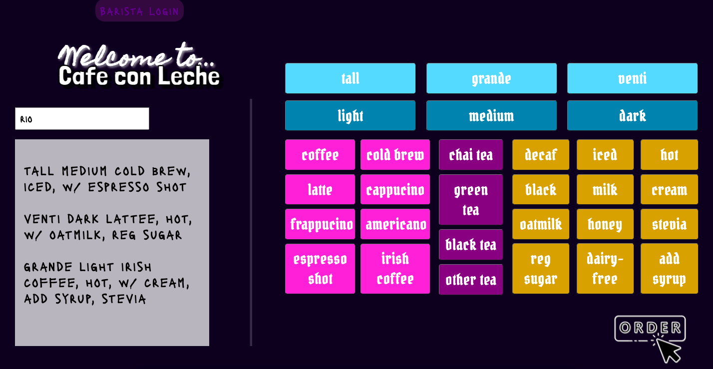
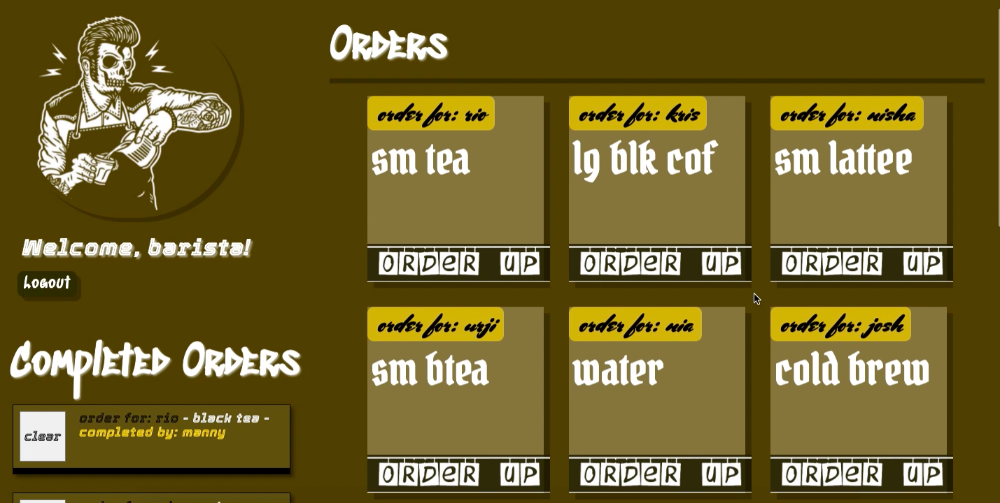
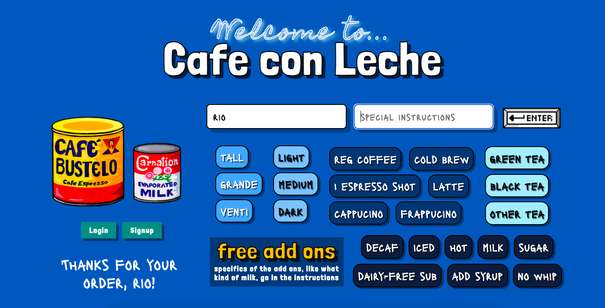

## Goal
A local coffee house is finally starting to take off ever since they introduced cold brew made from Kopi Luwak. They can’t handle their order volume and are starting to drop orders. Create an app that enables the cashier to enter the customer's name and their order. Then add that order to a queue that the baristas can see and give them the ability to mark an order complete. Completed orders should show which barista completed the order and have their own list. Bonus points if the app automatically says the customer's name out loud when an order is complete.

## How it's made
Made using CSS, Javascript, Node.js, JSON, Express, EJS, MongoDB, Mongoose, and User Authentification using passport.

## Lessons Learned
Learned how to manage multiple users on the app. Was able to have the app speak "order for customer's name is ready, so that was really fun to learn too. Created two different cashier pages - one design geared towards more "professional" screens, and the other design geared towards kids, inspired by the practice of Montessori cooking for young kids. The kids design is included but is not the default of this project. I'd like to circle back and be able to have a "kids mode" or a "work mode."
